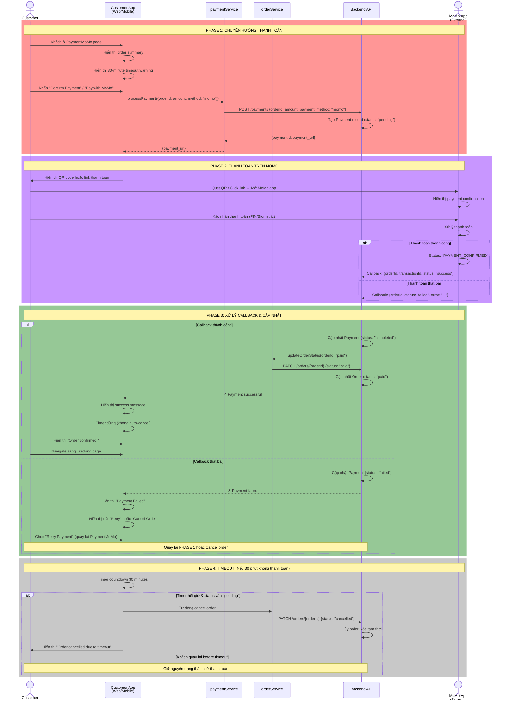
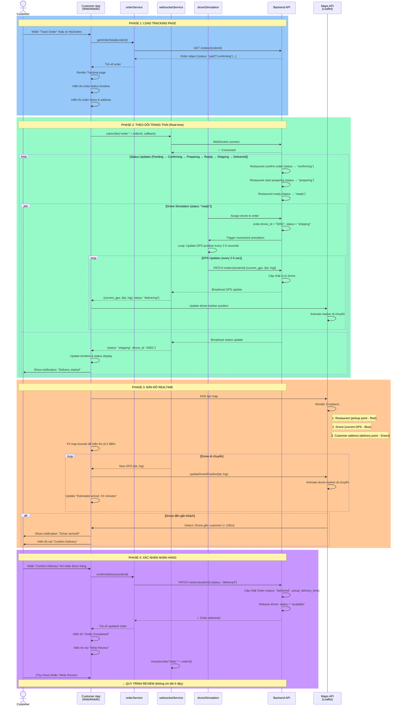

```mermaid
sequenceDiagram
    actor Restaurant as Restaurant Owner/<br/>Staff
    participant RestaurantApp as Restaurant App
    participant orderService
    participant websocketService
    participant droneService
    participant droneSimulation
    participant Backend as Backend API
    participant CustomerApp as Customer App

    rect rgb(200, 150, 255)
    Note over Restaurant,Backend: PHASE 1: AUTHENTICATION & DASHBOARD
    Restaurant->>RestaurantApp: 1. Đăng nhập hệ thống quản lý
    RestaurantApp->>RestaurantApp: Verify: role="restaurant_owner", status="active", restaurant.status="active"
    Restaurant->>RestaurantApp: Vào Dashboard
    RestaurantApp->>orderService: getOrders({restaurant_id: R1, status: "pending"})
    orderService->>Backend: GET /orders?restaurant_id=R1&status=pending
    Backend-->>orderService: Danh sách orders pending/new
    orderService-->>RestaurantApp: Hiển thị danh sách đơn hàng
    
    RestaurantApp->>websocketService: subscribe("restaurant:R1:orders")
    websocketService->>Backend: WebSocket connect
    Backend-->>websocketService: ✓ Connected
    Note over Restaurant,Backend: Khách tạo order mới → Broadcast tới RestaurantApp realtime
    end

    rect rgb(200, 150, 255)
    Note over Restaurant,Backend: PHASE 2: XEM DANH SÁCH ĐƠN MỚI
    RestaurantApp->>RestaurantApp: Hiển thị bảng Orders với columns:
    Note right of RestaurantApp: - Order ID, Time, Customer name
    Note right of RestaurantApp: - Items (qty, name), Total amount
    Note right of RestaurantApp: - Status badge (pending/confirming/...)
    
    alt Có order mới (Realtime notification)
        websocketService-->>RestaurantApp: New order event
        RestaurantApp->>RestaurantApp: Toast notification: "New order #ORD-123!"
        RestaurantApp->>RestaurantApp: Add order to top of list
        Restaurant->>Restaurant: Nghe thấy beep/notification
    end
    
    Restaurant->>RestaurantApp: Click order để xem chi tiết
    RestaurantApp->>orderService: getOrderDetail(orderId)
    orderService->>Backend: GET /orders/{orderId}
    Backend-->>orderService: Full order object
    orderService-->>RestaurantApp: Hiển thị OrderDetail page
    end

    rect rgb(150, 200, 150)
    Note over Restaurant,Backend: PHASE 3A: XÁC NHẬN ĐƠN (Accept)
    RestaurantApp->>RestaurantApp: Hiển thị chi tiết:
    Note right of RestaurantApp: - Items with quantities
    Note right of RestaurantApp: - Special instructions
    Note right of RestaurantApp: - Customer phone & address
    Note right of RestaurantApp: - Total amount
    
    Restaurant->>RestaurantApp: Kiểm tra: Có đủ sản phẩm trong kho?
    alt Đủ hàng & có thể chuẩn bị
        Restaurant->>RestaurantApp: Nhấn "Confirm Order"
        RestaurantApp->>orderService: updateOrderStatus(orderId, "confirming")
        orderService->>Backend: PATCH /orders/{orderId} {status: "confirming"}
        Backend->>Backend: Update Order (status: "confirming")
        Backend-->>orderService: ✓ Updated
        
        Backend->>websocketService: Broadcast status change
        websocketService-->>CustomerApp: Status updated: "pending" → "confirming"
        CustomerApp->>Customer: Notification: "Restaurant confirmed your order!"
        
        RestaurantApp->>RestaurantApp: Toast: "Order confirmed!"
        RestaurantApp->>RestaurantApp: Button changed to "Start Preparing"
    end
    end

    rect rgb(150, 200, 150)
    Note over Restaurant,Backend: PHASE 3B: TỪ CHỐI ĐƠN (Reject)
    alt Hết hàng hoặc không thể chuẩn bị
        Restaurant->>RestaurantApp: Nhấn "Reject Order"
        RestaurantApp->>RestaurantApp: Hiển thị form: rejection_reason (dropdown + text)
        Restaurant->>RestaurantApp: Chọn lý do: "Out of stock", "Kitchen busy", etc.
        Restaurant->>RestaurantApp: (Optional) Nhập ghi chú thêm
        Restaurant->>RestaurantApp: Nhấn "Confirm Rejection"
        
        RestaurantApp->>orderService: updateOrderStatus(orderId, "cancelled", {rejection_reason})
        orderService->>Backend: PATCH /orders/{orderId} {status: "cancelled", rejection_reason: "..."}
        Backend->>Backend: Update Order (status: "cancelled")
        
        alt Order đã thanh toán (MoMo)
            Backend->>Backend: Trigger auto-refund (payment_status: "refunded")
            Backend->>Backend: Send refund notification to customer
        end
        
        Backend->>websocketService: Broadcast cancellation
        websocketService-->>CustomerApp: Order cancelled with reason
        CustomerApp->>Customer: Notification: "Order rejected - reason: Out of stock"
        
        RestaurantApp->>RestaurantApp: Toast: "Order rejected"
        RestaurantApp->>RestaurantApp: Order removed from "pending" list
    end
    end

    rect rgb(150, 150, 200)
    Note over Restaurant,Backend: PHASE 4: CHUẨN BỊ HÀNG (Preparing)
    Restaurant->>RestaurantApp: Order status = "confirming"
    RestaurantApp->>RestaurantApp: Hiển thị "Start Preparing" button
    Restaurant->>RestaurantApp: Bắt đầu chuẩn bị (nhân viên nhà bếp tạo)
    Restaurant->>RestaurantApp: Nhấn "Start Preparing"
    
    RestaurantApp->>orderService: updateOrderStatus(orderId, "preparing")
    orderService->>Backend: PATCH /orders/{orderId} {status: "preparing"}
    Backend->>Backend: Update Order (status: "preparing")
    Backend-->>orderService: ✓ Updated
    
    Backend->>websocketService: Broadcast
    websocketService-->>CustomerApp: Status: "preparing"
    CustomerApp->>Customer: Notification: "Restaurant is preparing your food"
    
    RestaurantApp->>RestaurantApp: Button changed to "Ready for Pickup"
    end

    rect rgb(150, 150, 200)
    Note over Restaurant,Backend: PHASE 5: HÀNG SẴN SÀNG (Ready)
    Restaurant->>RestaurantApp: Nhân viên chuẩn bị xong
    Restaurant->>RestaurantApp: Nhấn "Ready for Pickup"
    
    RestaurantApp->>orderService: updateOrderStatus(orderId, "ready")
    orderService->>Backend: PATCH /orders/{orderId} {status: "ready"}
    Backend->>Backend: Update Order (status: "ready")
    
    Backend->>droneService: Auto-assign available drone
    droneService->>Backend: Select drone with capacity & closest location
    Backend->>droneService: PATCH /drones/{droneId} {assigned_order_id, status: "busy"}
    Backend->>Backend: Update Drone assignment
    Backend->>orderService: PATCH /orders/{orderId} {drone_id}
    Backend-->>orderService: ✓ Drone assigned
    
    Backend->>websocketService: Broadcast ready event
    websocketService-->>CustomerApp: Status: "ready" + drone info
    CustomerApp->>Customer: Notification: "Your food is ready & on the way!"
    
    RestaurantApp->>RestaurantApp: Toast: "Order ready!"
    RestaurantApp->>RestaurantApp: Hiển thị "Drone arriving in 5-10 minutes"
    end

    rect rgb(200, 150, 200)
    Note over Restaurant,Backend: PHASE 6: GIAO HÀNG & DRONE PICKUP
    RestaurantApp->>websocketService: subscribe("drone:" + droneId)
    websocketService->>Backend: WebSocket for drone location
    
    Backend->>droneSimulation: Trigger delivery simulation
    droneSimulation->>Backend: Phase 1: Drone ready at warehouse
    droneSimulation->>Backend: Phase 2: Drone moving to restaurant (1-2 min)
    
    loop Drone approaching
        droneSimulation->>Backend: Update drone GPS location
        Backend->>websocketService: Broadcast GPS
        websocketService-->>RestaurantApp: Drone location {lat, lng}
        RestaurantApp->>RestaurantApp: Show drone on map approaching restaurant
    end
    
    droneSimulation->>Backend: Drone arrived at restaurant location
    Backend->>websocketService: Broadcast "Drone arrived"
    websocketService-->>RestaurantApp: Drone at pickup point
    RestaurantApp->>Restaurant: Notification: "Drone arrived! Pickup your order"
    
    Restaurant->>RestaurantApp: Nhân viên mang hàng ra, giao cho drone
    Restaurant->>RestaurantApp: Nhấn "Confirm Handoff to Drone"
    
    RestaurantApp->>orderService: updateOrderStatus(orderId, "shipping")
    orderService->>Backend: PATCH /orders/{orderId} {status: "shipping"}
    Backend->>Backend: Update Order (status: "shipping")
    
    Backend->>droneSimulation: Resume delivery movement
    droneSimulation->>Backend: Phase 3: Drone moving to customer (2-5 min with GPS updates)
    
    loop GPS updates every 2-5 sec
        droneSimulation->>Backend: PATCH /orders/{orderId} {current_gps: {lat, lng}}
        Backend->>websocketService: Broadcast GPS
        websocketService-->>RestaurantApp: GPS update (optional: nhà hàng xem theo dõi)
        websocketService-->>CustomerApp: GPS update (khách thấy drone đang đến)
    end
    
    droneSimulation->>Backend: Drone arrived at customer location
    droneSimulation->>Backend: PATCH /orders/{orderId} {status: "delivered"}
    Backend->>Backend: Release drone: PATCH /drones/{droneId} {status: "available"}
    Backend-->>droneSimulation: ✓ Delivered
    
    Backend->>websocketService: Broadcast: Order delivered
    websocketService-->>RestaurantApp: Order completed
    RestaurantApp->>Restaurant: Notification: "Order delivered successfully!"
    
    Backend->>websocketService: Broadcast to customer
    websocketService-->>CustomerApp: Order delivered notification
    CustomerApp->>Customer: Notification & option to review
    end

    rect rgb(200, 200, 200)
    Note over Restaurant,Backend: PHASE 7: THEO DÕI GIAO HÀNG (Optional)
    Restaurant->>RestaurantApp: (Tùy chọn) Click "Track Delivery"
    RestaurantApp->>RestaurantApp: Hiển thị map with:
    Note right of RestaurantApp: - Restaurant location (pickup)
    Note right of RestaurantApp: - Drone current position (realtime)
    Note right of RestaurantApp: - Customer address (delivery)
    
    RestaurantApp->>RestaurantApp: Update drone position realtime (WebSocket)
    Note over Restaurant,Backend: Nếu có sự cố (drone muộn, hỏng), nhà hàng có thể:
    alt Drone hỏng hoặc muộn
        Restaurant->>AdminApp: Contact admin để reassign drone
        AdminApp->>droneService: Manual reassign drone
        Backend->>Backend: Cancel current drone, assign new one
    end
    end
```

```mermaid
sequenceDiagram
    actor Restaurant as Restaurant Owner
    participant RestaurantApp as Restaurant App
    participant foodService
    participant promotionService
    participant Backend as Backend API
    participant FileUpload as File Upload<br/>Service

    rect rgb(150, 200, 250)
    Note over Restaurant,Backend: PHASE 1: QUẢN LÝ MENU - THÊM SẢN PHẨM
    Restaurant->>RestaurantApp: Đăng nhập & vào Menu tab
    RestaurantApp->>foodService: getMenus(restaurantId)
    foodService->>Backend: GET /menus?restaurant_id=R1
    Backend-->>foodService: Danh sách sản phẩm hiện tại
    foodService-->>RestaurantApp: Hiển thị danh sách menu
    
    Restaurant->>RestaurantApp: Nhấn "Add Product"
    RestaurantApp->>RestaurantApp: Hiển thị form: name, description, price, category, image
    Restaurant->>RestaurantApp: Nhập thông tin sản phẩm
    Restaurant->>RestaurantApp: Upload ảnh sản phẩm
    RestaurantApp->>FileUpload: Upload file to server
    FileUpload->>Backend: Save to /public/images/foods/
    Backend-->>FileUpload: {imageUrl}
    FileUpload-->>RestaurantApp: {imageUrl}
    
    Restaurant->>RestaurantApp: Nhấn "Save"
    RestaurantApp->>foodService: create(menuData)
    foodService->>Backend: POST /menus {restaurant_id, name, price, ...}
    Backend->>Backend: Tạo menu record mới
    Backend-->>foodService: {menuId, status: "available"}
    foodService-->>RestaurantApp: ✓ Product added
    RestaurantApp->>RestaurantApp: Refresh menu list
    RestaurantApp->>Customer: Menu cập nhật realtime (nếu customer đang xem)
    end

    rect rgb(150, 200, 250)
    Note over Restaurant,Backend: PHASE 1B: SỬA/XÓA SẢN PHẨM
    Restaurant->>RestaurantApp: Click "Edit" trên sản phẩm
    RestaurantApp->>foodService: getMenuDetail(menuId)
    foodService->>Backend: GET /menus/{menuId}
    Backend-->>foodService: Menu object
    foodService-->>RestaurantApp: Pre-fill form với dữ liệu cũ
    
    alt Chỉnh sửa
        Restaurant->>RestaurantApp: Cập nhật fields: price, name, description, ...
        Restaurant->>RestaurantApp: (Optional) Upload ảnh mới
        Restaurant->>RestaurantApp: Nhấn "Save"
        RestaurantApp->>foodService: update(menuId, updatedData)
        foodService->>Backend: PATCH /menus/{menuId}
        Backend-->>foodService: ✓ Updated
        RestaurantApp->>RestaurantApp: Refresh menu list
    else Xóa
        Restaurant->>RestaurantApp: Nhấn "Delete"
        RestaurantApp->>RestaurantApp: Confirm dialog
        RestaurantApp->>foodService: delete(menuId)
        foodService->>Backend: DELETE /menus/{menuId}
        Backend->>Backend: Kiểm tra: có active orders không?
        alt Có orders
            Backend-->>foodService: ✗ Cannot delete (in use)
        else Không orders
            Backend->>Backend: Xóa menu record
            Backend-->>foodService: ✓ Deleted
            RestaurantApp->>RestaurantApp: Refresh
        end
    end
    end

    rect rgb(150, 200, 250)
    Note over Restaurant,Backend: PHASE 1C: ẨNHIỆN SẢN PHẨM (Tình trạng tồn kho)
    Restaurant->>RestaurantApp: Toggle "Available" switch trên sản phẩm
    RestaurantApp->>foodService: update(menuId, {is_available: true/false})
    foodService->>Backend: PATCH /menus/{menuId} {is_available: false}
    Backend-->>foodService: ✓ Updated
    RestaurantApp->>RestaurantApp: Cập nhật UI (gray out nếu unavailable)
    Backend->>Backend: Notifies customer apps (nếu đang xem menu)
    Customer-->>RestaurantApp: Khách thấy sản phẩm ẩn (unavailable)
    end

    rect rgb(200, 150, 255)
    Note over Restaurant,Backend: PHASE 2: QUẢN LÝ KHUYẾN MÃI
    Restaurant->>RestaurantApp: Vào "Promotions" tab
    RestaurantApp->>promotionService: getPromotions(restaurantId)
    promotionService->>Backend: GET /promotions?restaurant_id=R1
    Backend-->>promotionService: Danh sách promotions
    promotionService-->>RestaurantApp: Hiển thị danh sách
    
    Restaurant->>RestaurantApp: Nhấn "Create Promotion"
    RestaurantApp->>RestaurantApp: Hiển thị form: code, discount_type (%, fixed), value, start_date, end_date, min_order_amount, usage_limit
    Restaurant->>RestaurantApp: Nhập thông tin khuyến mãi
    Restaurant->>RestaurantApp: Nhấn "Save"
    
    RestaurantApp->>promotionService: create(promotionData)
    promotionService->>Backend: POST /promotions {restaurant_id, code, discount_type, discount_value, ...}
    Backend->>Backend: Validate code (không trùng, valid date range)
    alt Valid
        Backend->>Backend: Tạo promotion record
        Backend-->>promotionService: {promotionId, status: "active"}
        promotionService-->>RestaurantApp: ✓ Promotion created
    else Invalid
        Backend-->>promotionService: ✗ Error: code already exists
        promotionService-->>RestaurantApp: Error message
    end
    
    Restaurant->>RestaurantApp: (Tùy chọn) Edit hoặc Delete promotion
    Note over Restaurant,Backend: Tương tự update/delete menu
    end

    rect rgb(200, 150, 255)
    Note over Restaurant,Backend: PHASE 3: THEO DÕI HIỆU QUẢ KHUYẾN MÃI
    Restaurant->>RestaurantApp: Xem "Promotion Stats" tab
    RestaurantApp->>promotionService: getPromotionStats(promotionId)
    promotionService->>Backend: GET /promotions/{promotionId}/stats
    Backend-->>promotionService: {usage_count, total_discount_amount, revenue}
    promotionService-->>RestaurantApp: Hiển thị biểu đồ
    
    RestaurantApp->>RestaurantApp: Chart:
    Note right of RestaurantApp: - Usage count vs. limit
    Note right of RestaurantApp: - Total discount given
    Note right of RestaurantApp: - Revenue with this promo
    end
```

```mermaid
sequenceDiagram
    actor RestaurantOwner as Restaurant Owner
    participant CustomerApp as Customer App
    participant restaurantService
    participant authService
    participant Backend as Backend API
    actor Admin
    participant AdminApp as Admin App

    rect rgb(200, 150, 255)
    Note over RestaurantOwner,Backend: PHASE 1: NHÀ HÀNG ĐĂNG KÝ
    RestaurantOwner->>CustomerApp: Mở app & click "Become a Partner"
    CustomerApp->>CustomerApp: Redirect to RegisterRestaurant page
    RestaurantOwner->>CustomerApp: Nhập thông tin nhà hàng:
    Note right of CustomerApp: - Restaurant name, address, description
    Note right of CustomerApp: - Owner name, email, phone
    Note right of CustomerApp: - Password, opening hours
    
    RestaurantOwner->>CustomerApp: Nhấn "Submit Registration"
    CustomerApp->>restaurantService: validateEmail(email)
    restaurantService->>Backend: GET /users & /restaurants (check duplicates)
    Backend-->>restaurantService: Check results
    
    alt Email đã tồn tại
        restaurantService-->>CustomerApp: ✗ Email already exists
        CustomerApp->>RestaurantOwner: Show error message
    else Email mới & hợp lệ
        CustomerApp->>restaurantService: register(restaurantData)
        restaurantService->>Backend: POST /restaurants/register {name, address, owner_email, status: "pending"}
        Backend->>Backend: Tạo Restaurant record (status: "pending")
        Backend-->>restaurantService: {restaurantId}
        restaurantService-->>CustomerApp: ✓ Registered
        
        CustomerApp->>authService: registerOwner(ownerData)
        authService->>Backend: POST /users/register-owner {email, password, restaurant_id, roles: ["restaurant_owner"], status: "pending"}
        Backend->>Backend: Tạo User record (status: "pending")
        Backend-->>authService: ✓ User created
        
        CustomerApp->>RestaurantOwner: Show success message
        Note over RestaurantOwner,Backend: "Your restaurant is pending admin approval"
    end
    end

    rect rgb(150, 200, 250)
    Note over Admin,Backend: PHASE 2: ADMIN DUYỆT ĐƠN
    Admin->>AdminApp: Đăng nhập admin
    AdminApp->>AdminApp: Dashboard → Partners tab
    AdminApp->>restaurantService: getRestaurants({status: "pending"})
    restaurantService->>Backend: GET /restaurants?status=pending
    Backend-->>restaurantService: Danh sách pending restaurants
    restaurantService-->>AdminApp: Hiển thị danh sách
    
    Admin->>AdminApp: Click vào restaurant pending
    AdminApp->>restaurantService: getRestaurantDetail(restaurantId)
    restaurantService->>Backend: GET /restaurants/{restaurantId}
    Backend-->>restaurantService: Restaurant object
    restaurantService-->>AdminApp: Hiển thị chi tiết:
    Note right of AdminApp: - Owner info, address, description
    Note right of AdminApp: - Contact info, opening hours
    Note right of AdminApp: - Registration date, status
    
    Admin->>AdminApp: Review thông tin (verify legit)
    end

    rect rgb(150, 250, 200)
    Note over Admin,Backend: PHASE 3A: PHÊDUYỆT
    alt Admin phê duyệt
        Admin->>AdminApp: Nhấn "Approve"
        AdminApp->>restaurantService: approve(restaurantId)
        restaurantService->>Backend: PATCH /restaurants/{restaurantId} {status: "active"}
        Backend->>Backend: Update Restaurant (status: "active")
        
        Backend->>authService: PATCH /users/{ownerId} {status: "active"}
        Backend->>Backend: Update User (status: "active")
        
        Backend-->>restaurantService: ✓ Approved
        restaurantService-->>AdminApp: Success message
        
        Backend->>Backend: Send email to owner (approval notification)
        AdminApp->>AdminApp: Update UI
        
        RestaurantOwner->>RestaurantOwner: Receive email: "Restaurant approved!"
        RestaurantOwner->>CustomerApp: (Later) Login to restaurant-web
        CustomerApp->>restaurantService: login(email, password)
        restaurantService->>Backend: POST /auth/login
        Backend->>Backend: Check: role="restaurant_owner", status="active", restaurant.status="active"
        Backend-->>restaurantService: ✓ Login success
        restaurantService-->>RestaurantOwner: Vào dashboard → Setup menu, orders
    end
    end

    rect rgb(255, 200, 150)
    Note over Admin,Backend: PHASE 3B: TỬ CHỐI
    alt Admin từ chối
        Admin->>AdminApp: Nhấn "Reject"
        AdminApp->>AdminApp: Hiển thị form: rejection reason
        Admin->>AdminApp: Nhập lý do (e.g., "Invalid documents", "Incomplete info")
        Admin->>AdminApp: Nhấn "Confirm Reject"
        
        AdminApp->>restaurantService: reject(restaurantId, reason)
        restaurantService->>Backend: PATCH /restaurants/{restaurantId} {status: "blocked", rejection_reason: "..."}
        Backend->>Backend: Update Restaurant (status: "blocked")
        
        Backend->>authService: PATCH /users/{ownerId} {status: "blocked"}
        Backend->>Backend: Update User (status: "blocked")
        
        Backend-->>restaurantService: ✓ Rejected
        Backend->>Backend: Send email to owner (rejection notification + reason)
        
        AdminApp->>AdminApp: Update UI
        RestaurantOwner->>RestaurantOwner: Receive email: "Registration rejected - reason: ..."
        RestaurantOwner->>RestaurantOwner: Can reapply or contact support
    end
    end

    rect rgb(200, 200, 200)
    Note over Admin,Backend: PHASE 4: QUẢN LÝ NHÀ HÀNG HOẠT ĐỘNG (Optional)
    Admin->>AdminApp: Restaurants → Active restaurants list
    AdminApp->>restaurantService: getRestaurants({status: "active"})
    restaurantService->>Backend: GET /restaurants?status=active
    Backend-->>restaurantService: Danh sách
    
    alt Admin muốn khóa nhà hàng (vi phạm quy định)
        Admin->>AdminApp: Click "Block"
        AdminApp->>restaurantService: blockRestaurant(restaurantId)
        restaurantService->>Backend: PATCH /restaurants/{restaurantId} {status: "blocked"}
        Backend-->>restaurantService: ✓ Blocked
        Backend->>Backend: Send email to owner
        RestaurantOwner->>RestaurantOwner: Cannot login (account blocked)
    else Admin muốn mở khóa
        Admin->>AdminApp: Click "Unblock"
        AdminApp->>restaurantService: unblockRestaurant(restaurantId)
        restaurantService->>Backend: PATCH /restaurants/{restaurantId} {status: "active"}
        Backend-->>restaurantService: ✓ Unblocked
        RestaurantOwner->>RestaurantOwner: Can login again
    end
    end
```

```mermaid
sequenceDiagram
    actor Admin
    participant AdminApp as Admin App
    participant droneService
    participant droneSimulation
    participant orderService
    participant Backend as Backend API

    rect rgb(150, 200, 250)
    Note over Admin,Backend: PHASE 1: XEM DANH SÁCH DRONE
    Admin->>AdminApp: Delivery tab → Drones section
    AdminApp->>droneService: getAllDrones()
    droneService->>Backend: GET /drones
    Backend-->>droneService: Danh sách drones với fields:
    Note right of Backend: - id, identifier (e.g., "D001")
    Note right of Backend: - status (available/busy/offline/maintenance)
    Note right of Backend: - latitude, longitude (vị trí)
    Note right of Backend: - max_weight_kg, battery_level
    Note right of Backend: - assigned_order_id
    
    droneService-->>AdminApp: Hiển thị bảng drones
    AdminApp->>AdminApp: Danh sách với status badges (green/yellow/red)
    end

    rect rgb(150, 200, 250)
    Note over Admin,Backend: PHASE 2: THÊM DRONE MỚI
    Admin->>AdminApp: Nhấn "Add Drone"
    AdminApp->>AdminApp: Hiển thị form: identifier, max_weight_kg, location_address
    Admin->>AdminApp: Nhập: "D002", "5", "Warehouse HCM"
    Admin->>AdminApp: (Optional) Nhấn "Search" to geocode address
    AdminApp->>AdminApp: Geocode location → {lat, lng}
    Admin->>AdminApp: Xác nhận coordinates: 10.7769, 106.6982
    Admin->>AdminApp: Nhấn "Save"
    
    AdminApp->>droneService: create(droneData)
    droneService->>Backend: POST /drones {identifier, max_weight_kg, latitude, longitude, status: "available"}
    Backend->>Backend: Tạo Drone record
    Backend-->>droneService: {droneId: "D002"}
    droneService-->>AdminApp: ✓ Drone added
    AdminApp->>AdminApp: Refresh drone list
    end

    rect rgb(150, 200, 250)
    Note over Admin,Backend: PHASE 3: SỬA/XÓA DRONE
    Admin->>AdminApp: Click "Edit" trên drone
    AdminApp->>droneService: getDroneDetail(droneId)
    droneService->>Backend: GET /drones/{droneId}
    Backend-->>droneService: Drone object
    droneService-->>AdminApp: Pre-fill form
    
    alt Chỉnh sửa
        Admin->>AdminApp: Cập nhật: max_weight_kg, location
        Admin->>AdminApp: Nhấn "Save"
        AdminApp->>droneService: update(droneId, updatedData)
        droneService->>Backend: PATCH /drones/{droneId}
        Backend-->>droneService: ✓ Updated
    else Xóa
        Admin->>AdminApp: Nhấn "Delete"
        alt Drone status = "available"
            AdminApp->>droneService: delete(droneId)
            droneService->>Backend: DELETE /drones/{droneId}
            Backend-->>droneService: ✓ Deleted
        else Drone status = "busy"
            AdminApp->>AdminApp: Show error: "Cannot delete busy drone"
        end
    end
    end

    rect rgb(200, 150, 255)
    Note over Admin,Backend: PHASE 4: KHÓA/MỞ KHÓA DRONE
    Admin->>AdminApp: Toggle "Lock/Unlock" switch trên drone
    AdminApp->>droneService: updateDroneStatus(droneId, "maintenance")
    droneService->>Backend: PATCH /drones/{droneId} {status: "maintenance"}
    Backend->>Backend: Update Drone status
    Backend-->>droneService: ✓ Status updated
    AdminApp->>AdminApp: Update UI (gray out if maintenance)
    Note over Admin,Backend: System không gán orders cho drone này
    
    Admin->>AdminApp: Later, toggle "Unlock"
    AdminApp->>droneService: updateDroneStatus(droneId, "available")
    droneService->>Backend: PATCH /drones/{droneId} {status: "available"}
    Backend-->>droneService: ✓ Status updated
    AdminApp->>AdminApp: Update UI (available again)
    end

    rect rgb(255, 200, 150)
    Note over Admin,Backend: PHASE 5: TỰ ĐỘNG GÁN DRONE (Auto Assignment)
    Note over Admin,Backend: Quy trình này xảy ra khi order.status = "ready"
    Backend->>Backend: Restaurant mark order as "ready"
    Backend->>Backend: Trigger: Find available drone with capacity
    
    alt Available drone found
        Backend->>Backend: Lựa chọn drone tối ưu:
        Note right of Backend: - status = "available"
        Note right of Backend: - max_weight_kg >= order_weight
        Note right of Backend: - Gần nhất với restaurant location
        
        Backend->>droneService: assignDroneToOrder(droneId, orderId)
        droneService->>Backend: PATCH /drones/{droneId} {assigned_order_id, status: "busy"}
        Backend->>Backend: Update Drone
        Backend->>orderService: updateOrderStatus(orderId, "shipping", {drone_id})
        orderService->>Backend: PATCH /orders/{orderId} {drone_id, status: "shipping"}
        Backend->>Backend: Update Order
        Backend->>droneSimulation: triggerDelivery(orderId, droneId)
        
        droneSimulation->>Backend: Simulation phase 1: Drone ready at warehouse
        droneSimulation->>Backend: Simulation phase 2: Pickup (1-2 min)
        droneSimulation->>Backend: Simulation phase 3: Delivery with GPS updates (every 2-5 sec)
        droneSimulation->>Backend: Simulation phase 4: Delivered
        
        Backend->>droneService: updateDroneStatus(droneId, "available")
        droneService->>Backend: PATCH /drones/{droneId} {status: "available", assigned_order_id: null}
        Backend-->>droneService: ✓ Drone available again
        
    else No drone available
        Backend->>Backend: Queue order (status: "ready", waiting for drone)
        Backend->>Admin: Notification: "Manual drone assignment needed"
        Admin->>AdminApp: Manual assign drone
        AdminApp->>droneService: assignDroneToOrder(droneId, orderId)
        droneService-->>Backend: ✓ Manually assigned
    end
    end

    rect rgb(200, 200, 200)
    Note over Admin,Backend: PHASE 6: MONITORING & INTERVENTION
    Admin->>AdminApp: Delivery → Map tab
    AdminApp->>AdminApp: Hiển thị bản đồ realtime:
    Note right of AdminApp: - Tất cả drones (busy + available)
    Note right of AdminApp: - Orders (shipping)
    Note right of AdminApp: - Connections: Restaurant → Drone → Customer
    
    AdminApp->>AdminApp: Real-time updates via WebSocket
    Note over Admin,Backend: Nếu có sự cố (drone offline, late, etc.)
    Admin->>AdminApp: Click drone marker → Show options
    AdminApp->>AdminApp: Menu: "Recall", "Reassign", "Contact Driver"
    
    alt Drone hỏng/muộn
        Admin->>AdminApp: Click "Reassign Order"
        AdminApp->>droneService: assignDroneToOrder(newDroneId, orderId)
        droneService->>Backend: Update assignments
        Backend->>Backend: Trigger new delivery with new drone
        AdminApp->>AdminApp: Notification to customer about driver change
    end
    end
```

# 📊 6 QUY TRÌNH CHÍNH - SEQUENCE DIAGRAMS

---

## **1️⃣ QUY TRÌNH ĐẶT HÀNG (Order Placement Process)**

### Mô tả:
Khách cung cấp địa chỉ giao, duyệt menu, thêm vào giỏ, áp dụng khuyến mãi, chọn thanh toán, và tạo order.

### Sequence Diagram:

```mermaid
sequenceDiagram
    actor Customer
    participant CustomerApp as Customer App<br/>(Web/Mobile)
    participant LocalStorage as LocalStorage/<br/>AsyncStorage
    participant authService
    participant restaurantService
    participant foodService
    participant cartService
    participant promotionService
    participant orderService
    participant Backend as Backend API<br/>(json-server)

    rect rgb(200, 150, 255)
    Note over Customer,Backend: PHASE 1: AUTHENTICATION (Nếu chưa đăng nhập)
    Customer->>CustomerApp: 1. Mở ứng dụng
    CustomerApp->>LocalStorage: Kiểm tra token & user
    alt Token có sẵn
        LocalStorage-->>CustomerApp: Trả về token & user info
        CustomerApp->>authService: Validate token (optional)
    else Chưa đăng nhập
        CustomerApp->>Customer: Hiển thị LoginPopup
        Customer->>CustomerApp: Nhập email & password
        CustomerApp->>authService: login(email, password)
        authService->>Backend: POST /auth/login
        Backend-->>authService: {token, user}
        authService->>LocalStorage: Lưu token & user
        authService-->>CustomerApp: ✓ Login thành công
    end
    end

    rect rgb(200, 150, 255)
    Note over Customer,Backend: PHASE 2: TÌM KIẾM NHÀ HÀNG
    Customer->>CustomerApp: 2. Cấp phép GPS (hoặc nhập địa chỉ)
    CustomerApp->>CustomerApp: Lấy vị trí hiện tại (lat, lng)
    CustomerApp->>restaurantService: getRestaurants({lat, lng, radius: 5000})
    restaurantService->>Backend: GET /restaurants?lat=X&lng=Y
    Backend-->>restaurantService: Danh sách nhà hàng gần
    restaurantService-->>CustomerApp: Hiển thị danh sách
    CustomerApp->>CustomerApp: Cho phép filter theo category, search
    Customer->>CustomerApp: Chọn 1 nhà hàng
    end

    rect rgb(150, 200, 150)
    Note over Customer,Backend: PHASE 3: XEM MENU & THÊM VÀO GIỎ
    CustomerApp->>foodService: getMenus(restaurantId)
    foodService->>Backend: GET /menus?restaurant_id=R1
    Backend-->>foodService: Danh sách sản phẩm
    foodService-->>CustomerApp: Hiển thị menu
    Customer->>CustomerApp: Chọn sản phẩm, nhập số lượng, ghi chú
    CustomerApp->>cartService: addToCart({foodId, qty, notes})
    cartService->>LocalStorage: Lưu item vào giỏ
    LocalStorage-->>cartService: ✓
    cartService-->>CustomerApp: Cập nhật giỏ hàng
    CustomerApp->>CustomerApp: Hiển thị toast "Item added"
    Customer->>CustomerApp: (Tùy chọn) Tiếp tục thêm sản phẩm khác
    Customer->>CustomerApp: Click "Proceed to Checkout"
    end

    rect rgb(150, 200, 150)
    Note over Customer,Backend: PHASE 4: ĐỊA CHỈ GIAO & THÔNG TIN
    CustomerApp->>CustomerApp: Hiển thị trang CheckoutInfo
    CustomerApp->>CustomerApp: Lấy danh sách địa chỉ đã lưu từ localStorage
    Customer->>CustomerApp: Chọn địa chỉ sẵn có hoặc nhập mới
    alt Địa chỉ mới
        Customer->>CustomerApp: Nhập: street, ward, district, city, phone, GPS
        CustomerApp->>LocalStorage: addressService.create(newAddress)
    else Địa chỉ cũ
        CustomerApp->>CustomerApp: Sử dụng địa chỉ đã chọn
    end
    end

    rect rgb(255, 200, 150)
    Note over Customer,Backend: PHASE 5: KHUYẾN MÃI & TÍNH TOÁN
    Customer->>CustomerApp: (Tùy chọn) Nhập mã khuyến mãi
    CustomerApp->>promotionService: validatePromoCode(code, subtotal)
    promotionService->>Backend: GET /promotions?code=ABC123
    Backend-->>promotionService: Promo object
    promotionService->>promotionService: Verify: code hợp lệ, còn hạn, còn lượt dùng
    alt Hợp lệ
        promotionService->>promotionService: Tính discount_amount
        promotionService-->>CustomerApp: ✓ {discountAmount, percentage}
        CustomerApp->>CustomerApp: Cập nhật tổng tiền
    else Không hợp lệ
        promotionService-->>CustomerApp: ✗ Error message
        CustomerApp->>Customer: Hiển thị lỗi
    end
    end

    rect rgb(255, 150, 150)
    Note over Customer,Backend: PHASE 6: CHỌN THANH TOÁN & ĐẶT HÀNG
    Customer->>CustomerApp: Chọn phương thức thanh toán (MoMo hoặc Cash)
    CustomerApp->>CustomerApp: Tính final total: subtotal + delivery_fee - discount
    Customer->>CustomerApp: Review đơn & nhấn "Place Order"
    
    alt Thanh toán MoMo
        CustomerApp->>orderService: create(orderData)
        orderService->>Backend: POST /orders { user_id, restaurant_id, items[], ... }
        Backend-->>orderService: {orderId, status: "pending"}
        orderService-->>CustomerApp: ✓ Order created
        CustomerApp->>cartService: clearCart()
        cartService->>LocalStorage: Xóa giỏ hàng
        CustomerApp->>CustomerApp: Redirect sang PaymentMoMo page
        Note over Customer,Backend: → QUY TRÌNH 2: THANH TOÁN (MoMo)
    else Thanh toán Cash (COD)
        CustomerApp->>orderService: create({...orderData, payment_method: "cash"})
        orderService->>Backend: POST /orders {...}
        Backend-->>orderService: {orderId, status: "pending"}
        orderService-->>CustomerApp: ✓ Order created
        CustomerApp->>cartService: clearCart()
        cartService->>LocalStorage: Xóa giỏ hàng
        CustomerApp->>CustomerApp: Redirect sang Tracking page
        Note over Customer,Backend: → QUY TRÌNH 3: THEO DÕI
    end
```

### Chi tiết dòng dữ liệu:

**Input:**
- Địa chỉ giao hàng (lat, lng, address_text)
- Danh sách sản phẩm (menu_id, qty, ghi chú)
- Mã khuyến mãi (nếu có)
- Phương thức thanh toán

**Output:**
- Order ID mới
- Order status: "pending"
- Payment status: "pending" (MoMo) hoặc "pending" (Cash)

**Entities:**
- `Customer` (actor)
- `Order` (new)
- `Cart` (empty sau)
- `Payment` (pending)

---

## **2️⃣ QUY TRÌNH XỬ LÝ ĐƠN HÀNG CỦA NHÀ HÀNG (Restaurant Order Processing)**

### Mô tả:
Nhà hàng xem danh sách đơn mới, xác nhận/từ chối, chuẩn bị hàng, và giao cho drone.

### Sequence Diagram:



### Chi tiết dòng dữ liệu:

**Input:**
- Order ID
- Accept/Reject decision
- Rejection reason (nếu từ chối)
- Handoff confirmation

**Output:**
- Order status transitions: pending → confirming → preparing → ready → shipping → delivered
- Drone assignment (auto or manual)
- Realtime GPS updates
- Customer notifications

**Entities:**
- `Order` (status change)
- `Drone` (assigned, status change)
- Notifications (WebSocket broadcast)

---

## **3️⃣ QUY TRÌNH THANH TOÁN MOMO (MoMo Payment Process)**

### Mô tả:
Khách thanh toán đơn hàng qua MoMo, hệ thống xác thực thanh toán, và cập nhật order status.

### Sequence Diagram:



### Chi tiết dòng dữ liệu:

**Input:**
- Order ID
- Amount (VND)
- Payment method: "momo"

**Output:**
- Payment status: "completed" hoặc "failed"
- Order status: "paid" hoặc "pending"
- Transaction ID

**External:**
- MoMo App (simulator trong DEV)

---

## **3️⃣ QUY TRÌNH THEO DÕI ĐƠN HÀNG (Order Tracking Process)**

### Mô tả:
Khách xem trạng thái đơn hàng realtime, bản đồ drone, và xác nhận nhận hàng.

### Sequence Diagram:



### Chi tiết dòng dữ liệu:

**Input:**
- Order ID

**Output:**
- Order status realtime (pending → paid → confirming → preparing → ready → shipping → delivered)
- GPS position (lat, lng) mỗi 2-5 giây
- Estimated delivery time
- Delivery confirmation

**Communication:**
- WebSocket subscribe/unsubscribe
- REST API GET (initial load)
- Maps API (Leaflet)

---

## **4️⃣ QUY TRÌNH QUẢN LÝ MENU & KHUYẾN MÃI (Restaurant Menu & Promotion Management)**

### Mô tả:
Chủ nhà hàng quản lý menu sản phẩm, khuyến mãi, và cập nhật tình trạng tồn kho.

### Sequence Diagram:



### Chi tiết dòng dữ liệu:

**Menu Management:**
- Input: menu data (name, price, category, image)
- Output: menuId, status: "available"
- Enum: is_available (true/false)

**Promotion Management:**
- Input: code, discount_type ("percentage"/"fixed"), value, date range, min_order, limit
- Output: promotionId, status: "active"
- Tracking: usage_count, total_discount, revenue

---

## **5️⃣ QUY TRÌNH DUYỆT ĐĂ KÝ NHÀ HÀNG (Restaurant Registration Approval)**

### Mô tả:
Quản trị viên kiểm tra và phê duyệt yêu cầu đăng ký nhà hàng mới.

### Sequence Diagram:



### Chi tiết dòng dữ liệu:

**Registration:**
- Input: restaurant_name, address, owner_email, password, phone, opening_hours
- Output: restaurantId, userId, status: "pending"
- Email: validation

**Approval:**
- Input: restaurantId, approval_status ("active"/"blocked"), rejection_reason
- Output: User & Restaurant status updated
- Notification: Email to owner

---

## **6️⃣ QUY TRÌNH QUẢN LÝ DRONE (Drone Management)**

### Mô tả:
Quản trị viên quản lý fleet drone: thêm, sửa, khóa, và tự động gán drone cho orders.

### Sequence Diagram:



### Chi tiết dòng dữ liệu:

**Drone Management:**
- Input: identifier, max_weight_kg, location (lat, lng)
- Output: droneId, status
- Status enum: "available", "busy", "offline", "maintenance"

**Auto Assignment:**
- Trigger: Order status = "ready"
- Algorithm: Find available drone with capacity closest to restaurant
- Output: Drone assigned, simulation started

**Monitoring:**
- Real-time GPS updates (every 2-5 seconds)
- WebSocket broadcast
- Manual intervention options

---

## 📋 TÓM TẮT 6 QUY TRÌNH

| # | Quy Trình | Actors | Trigger | Main Actions | Output |
|---|---|---|---|---|---|
| 1 | Đặt hàng | Customer, Restaurant, Backend | Customer browse | Select menu → Cart → Checkout → Place order | Order created (pending) |
| 2 | Thanh toán MoMo | Customer, MoMo, Backend | Customer click "Pay" | Redirect MoMo → Confirm → Callback → Update order | Payment completed, Order paid |
| 3 | Theo dõi | Customer, Restaurant, Drone, Backend | Order shipping | WebSocket subscribe → GPS updates → Map display → Confirm delivery | Order delivered |
| 4 | Menu & Promo | Restaurant, Backend | Restaurant dashboard | Add/Edit/Delete menu → Create/Edit promo → Track stats | Menu/Promo updated |
| 5 | Restaurant Approval | RestaurantOwner, Admin, Backend | Owner register | Submit form → Admin review → Approve/Reject → Email notification | Restaurant active/blocked |
| 6 | Drone Management | Admin, Drone, Backend | Admin dashboard | View drones → Add/Edit/Delete → Lock/Unlock → Auto assign → Monitor | Drone assigned, Delivery started |

---

## 🔑 KỸ THUẬT DÙNG

- **WebSocket:** Real-time order status & GPS updates
- **RESTful API:** CRUD operations
- **File Upload:** Menu & drone images
- **Geolocation:** Address → coordinates
- **Maps API:** Realtime drone tracking
- **Simulation:** Drone movement & delivery process
- **Async/Await:** Error handling & callbacks
- **Event Broadcasting:** Status updates to all connected clients

